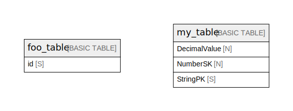

# Amazon DynamoDB (ap-northeast-1)

## Tables

| Name | Attributes | Comment | Type |
| ---- | ------- | ------- | ---- |
| [foo_table](foo_table.md) | 1 |  | BASIC TABLE |
| [my_table](my_table.md) | 3 |  | BASIC TABLE |

## Relations

---

> Generated by [tbls](https://github.com/k1LoW/tbls)
