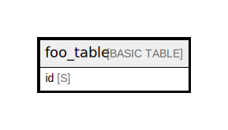

# foo_table

## Description

## Attributes

| Name | Type | Default | Nullable | Children | Parents | Comment |
| ---- | ---- | ------- | -------- | -------- | ------- | ------- |
| id | S |  | false |  |  |  |

## Primary Key

| Name | Type | Definition |
| ---- | ---- | ---------- |
| Primary Key | Partition key | [{ AttributeName: "id", KeyType: "HASH" }] |

## Relations

---

> Generated by [tbls](https://github.com/k1LoW/tbls)
