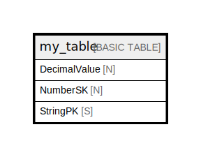

# my_table

## Description

## Attributes

| Name | Type | Default | Nullable | Children | Parents | Comment |
| ---- | ---- | ------- | -------- | -------- | ------- | ------- |
| DecimalValue | N |  | false |  |  |  |
| NumberSK | N |  | false |  |  |  |
| StringPK | S |  | false |  |  |  |

## Primary Key

| Name | Type | Definition |
| ---- | ---- | ---------- |
| Primary Key | Partition key and sort key | [{ AttributeName: "StringPK", KeyType: "HASH" } { AttributeName: "NumberSK", KeyType: "RANGE" }] |

## Secondary Indexes

| Name | Definition |
| ---- | ---------- |
| NumberSK-index | GlobalSecondaryIndex { [{ AttributeName: "NumberSK", KeyType: "HASH" }], { NonKeyAttributes: ["DecimalValue","JsonValue"], ProjectionType: "INCLUDE" } } |
| NumberSK-DecimalValue-index | GlobalSecondaryIndex { [{ AttributeName: "NumberSK", KeyType: "HASH" } { AttributeName: "DecimalValue", KeyType: "RANGE" }], { ProjectionType: "ALL" } } |

## Relations

---

> Generated by [tbls](https://github.com/k1LoW/tbls)
